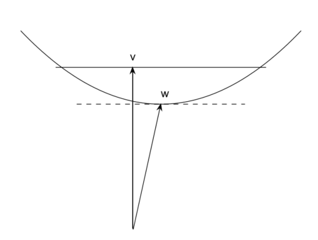

# 第一部分 线性代数概念和矩阵分解

## 1.1 数据挖掘与模式识别

在现代社会中，大量数据被收集并存储在计算机中，以便以后可以提取有用的信息。通常在收集时不知道以后会请求什么数据，因此数据库不是为了提取任何特定信息而设计的，而是在很大程度上是非结构化的。从大型数据集中提取有用信息的科学通常被称为“数据挖掘”，有时会增加“知识发现”。

模式识别通常被认为是一种与数据挖掘不同的技术，但其定义是相关的： “采用原始数据并根据模式的'类别'采取行动的行为”[31]。在本书中，我们不会强调概念之间的差异。

数据挖掘有许多应用领域，从电子商务[10,69]到生物信息学[6]，从科学应用，如金星[21]上的火山分类到信息检索[3]和互联网搜索引擎[ 11]。

数据挖掘是一门真正的跨学科科学，其中使用来自计算机科学，统计学和数据分析，线性代数和优化的技术，这些技术通常采用相当折衷的方式。由于应用的实际重要性，该领域现在有许多书籍和文献[24,25,31,35,45,46,47,49,108]。

可以毫不夸张地说，日常生活中充满了我们通常不知不觉地依赖于先进的数据挖掘数学方法的情境。线性代数和数据分析等方法是许多数据挖掘技术的基本要素。本书介绍了数学和数值方法及其在数据挖掘和模式识别中的应用。

## 1.2 向量和矩阵

以下示例说明了向量和矩阵在数据挖掘中的使用。这些示例介绍了本书中讨论的主要数据挖掘区域，将在第II部分中对其进行更详细的描述。

在许多应用中，矩阵只是一个矩形的数据数组，元素是标量的实数

$$A = \left( \begin{array} { c c c c } { a _ { 11 } } & { a _ { 12 } } & { \cdots } & { a _ { 1 n } } \\ { a _ { 21 } } & { a _ { 22 } } & { \cdots } & { a _ { 2 n } } \\ { \vdots } & { \vdots } & { } & { \vdots } \\ { a _ { m 1 } } & { a _ { m 2 } } & { \cdots } & { a _ { m n } } \end{array} \right) \in \mathbb { R } ^ { m \times n }$$

要通过数学方法处理数据，必须添加一些数学结构。在最简单的情况下，矩阵的列被视为向量$\mathbb {R} ^ {m}$

**例1.1** 术语文档矩阵用于信息检索。考虑以下五个文件的选择$^1$。关键词，我们称之为术语，用粗体标出$^2$。

文档1：**Google$\rm ^{TM}$矩阵**P是**互联网**的模型。
文档2：如果存在从**网页**j到i的**链接**，则$P_{ij}$非零。
文档3：**Google矩阵**用于对所有**网页**进行**排名**。
文档4：通过解决**矩阵特征值**问题来完成**排名**。
文档5：**英格兰队**退出**国际足联**排名前十

如果我们计算每个文档中术语的频率，我们会得到以下结果：

| Term       | Doc 1 | Doc 2 | Doc 3 | Doc 4 | Doc 5 |
| ---------- | ----- | ----- | ----- | ----- | ----- |
| eigenvalue | 0     | 0     | 0     | 1     | 0     |
| England    | 0     | 0     | 0     | 0     | 1     |
| FIFA       | 0     | 0     | 0     | 0     | 1     |
| Google     | 1     | 0     | 1     | 0     | 0     |
| Internet   | 1     | 0     | 0     | 0     | 0     |
| link       | 0     | 1     | 0     | 0     | 0     |
| matrix     | 1     | 0     | 1     | 1     | 0     |
| page       | 0     | 1     | 1     | 0     | 0     |
| rank       | 0     | 0     | 1     | 1     | 1     |
| Web        | 0     | 1     | 1     | 0     | 0     |

$^{1}$在5号文档中，国际足联是国际足球联合会的成员。这份文件显然与足球有关。该文章是2005年的报纸头条。2006年世界杯结束后，英格兰重返前十。
$^{2}$为了避免使示例过大，我们忽略了一些通常被视为术语的单词（关键词）。请注意，只有单词的词干是重要的。

因此，每个文档都由$\mathbb { R } ^ { 10 }$中的向量或点表示，我们可以将所有文档组织成一个term-document矩阵：

$A = \left( \begin{array} { c c c c c } { 0 } & { 0 } & { 0 } & { 1 } & { 0 } \\ { 0 } & { 0 } & { 0 } & { 0 } & { 1 } \\ { 0 } & { 0 } & { 0 } & { 0 } & { 1 } \\ { 1 } & { 0 } & { 1 } & { 0 } & { 0 } \\ { 1 } & { 0 } & { 0 } & { 0 } & { 0 } \\ { 0 } & { 1 } & { 0 } & { 0 } & { 0 } \\ { 1 } & { 0 } & { 1 } & { 1 } & { 0 } \\ { 0 } & { 1 } & { 1 } & { 0 } & { 0 } \\ { 0 } & { 0 } & { 1 } & { 1 } & { 1 } \\ { 0 } & { 1 } & { 1 } & { 0 } & { 0 } \end{array} \right)$

现在假设我们想要在所有文档中查找“**网页排名**”相关文档。这由向量*query*表示，以类似于term-document矩阵的方式构造：

$q = \left( \begin{array} { l } { 0 } \\ { 0 } \\ { 0 } \\ { 0 } \\ { 0 } \\ { 0 } \\ { 0 } \\ { 1 } \\ { 1 } \\ { 1 } \end{array} \right) \in \mathbb { R } ^ { 10 }$

因此，query本身被视为文档。现在可以将信息检索任务表述为数学问题：*找到接近向量q的列A*。要解决这个问题，我们必须在$\mathbb {R} ^ {10}$中使用一些距离测量。

在信息检索应用中，维度m通常很大，比如$10^6$。此外，由于大多数文档仅包含一小部分术语，因此矩阵中的大多数元素等于零。这种矩阵称为*稀疏*矩阵。

一些用于信息检索的方法使用线性代数技术（例如，奇异值分解（SVD））来进行数据压缩和检索增强。第11章介绍了用于信息检索的向量空间方法。

将矩阵不仅视为数字数组，还是作为一组向量，而且作为线性算子，通常是有用的。表示A的列

$a _{ . j } = \left(\begin{array} { c } { a _{ 1 j } } \\ { a _{ 2 j } } \\ { \vdots } \\ { a _{ m j } } \end{array} \right) , \quad j = 1,2 , \ldots , n$

矩阵A表示为

$A = \left(\begin{array} { l l l l } { a ._1 } & { a . _2 } & { \cdots } & { a. _{ n } } \end{array} \right)$

然后定义线性变换

$y = A x = \left(\begin{array} { c c c c } { a .1 } & { a .2 } & { \ dots } & { a _{ . n } } \end{array} \right) \left(\begin{array} { c } { x _{ 1 } } \\ { x _{ 2 } } \\ { \vdots } \\ { x _{ n } } \end{array} \right) = \sum\limits_{ j = 1 } ^ { n } x _{ j } a _{ . j }$

**例1.2** 手写数字的分类是*模式识别*中的模型问题。这里的向量用于表示数字。一个数字的图像是16×16的数字矩阵，表示灰度。它也可以通过堆叠矩阵的列表示为$\mathbb{R}^{256}$中的矢量。然后，一组n个数字（比如说是手写的3）可以由矩阵$A\in \mathbb{R}^{256\times n}$表示，并且A的列跨越$\mathbb{R}^{256}$的子空间。我们可以使用SVD $A=U\Sigma V^T$计算该子空间的近似基础。 “子子空间”的三个基矢量如图1.1所示。

**图1.1** *来自美国邮政服务数据库的手写数字[47]和3的基本向量（底部）*

设b是表示未知数字的向量。我们现在想要将未知数字（通过计算机自动）分类为数字0到9之一。给定一组3的近似基矢量，$u_1，u_2，\cdots，u_k$，我们可以通过检查是否存在基矢量的线性组合来确定b是否为3。 $\sum_{j = 1}^k x_j u_j$，像这样$b - \sum\limits_ { j = 1 } ^ { k } x _ { j } u _ { j }$ 小。因此，这里我们计算b坐标的偏置$\{u_j\}^{k}_{j=1}$

在第10章中，我们讨论了手写数字分类的方法。

数据挖掘的想法是从大型的，通常也是非结构化的数据集中提取有用的信息。因此，所使用的方法必须是有效的且一般是专门针对大型问题而设计的。在一些数据挖掘项目中，会出现巨大的矩阵。

**例1.3** 搜素引擎的工作是从因特网上可用的所有网页中提取信息的任务。 Google搜索引擎的核心是矩阵计算，可能是最大的矩阵计算[71]。 Google矩阵 $P$ 的数量为数十亿，即接近互联网上的网页总数。矩阵是基于Web的链接构造的，如果存在从Web页面 $j$ 到 $i$ 的链接，则元素$P_{ij}$非零。

以下的小链接图说明了一组具有向外链接和向内链接的网页：

构造相应的链接图矩阵，使得列和行表示网页，列 $j$ 中的非零元素表示来自网页 $j$ 的外链。矩阵表示如下

$P = \left( \begin{array} { c c c c c c } { 0 } & { \frac { 1 } { 3 } } & { 0 } & { 0 } & { 0 } & { 0 } \\ { \frac { 1 } { 3 } } & { 0 } & { 0 } & { 0 } & { 0 } & { 0 } \\ { 0 } & { \frac { 1 } { 3 } } & { 0 } & { 0 } & { \frac { 1 } { 3 } } & { \frac { 1 } { 2 } } \\ { \frac { 1 } { 3 } } & { 0 } & { 0 } & { 0 } & { \frac { 1 } { 3 } } & { 0 } \\ { \frac { 1 } { 3 } } & { \frac { 1 } { 3 } } & { 0 } & { 0 } & { 0 } & { \frac { 1 } { 2 } } \\ { 0 } & { 0 } & { 1 } & { 0 } & { \frac { 1 } { 3 } } & { 0 } \end{array} \right)$

要使搜索引擎有效，它必须使用网页质量的排名。Google矩阵用于对所有页面进行排名。通过求解 $P$ 的特征值问题来完成排名;见第12章。

## 1.3 本书的目的

本书主要不是数值线性代数中的教科书，而是当今线性代数一些技术的应用导论，重点是数据挖掘和模式识别。它在很大程度上取决于易使用的编程环境的可用性，该环境实现了我们将介绍的算法。因此，我们不会详细描述算法，而是提供足够的数学理论和数值背景信息，以便读者能够理解和使用包含在如MATLAB [68]这种强大软件中。

有关本书中使用的矩阵分解的数值和算法方面的更全面的介绍，请参阅近年的教科书[29,42,50,92,93,97]。在[4,5]中详细讨论了大型稀疏系统的线性系统和特征值问题的解。对于那些想要研究数值线性代数算法的详细实现的人来说，可以通过因特网免费获得Fortran，C和C ++中的软件[1]。

假设读者已经学习了线性代数和科学计算（数值分析）的入门课程。熟悉面向矩阵的编程语言（如MATLAB）的基础知识应该有助于人们关注文稿内容。

## 1.4 编程环境

在本书中，我们使用MATLAB [68]来演示概念和算法。我们的代码不应被视为软件;相反，它们旨在展示基本原理，我们强调简单而不是效率和稳健性。*这些代码只能用于小型实验，绝不能用于生产计算。*

即使我们使用MATLAB，我们也想强调可以使用任何实现现代矩阵计算的编程环境，例如，Mathematica$ ^ \circledR $ [112]或统计学库。

## 1.5 浮点计算

### 1.5.1 浮点计数

有时可以通过计算浮点运算的次数，即具有*浮点数的算术运算*来比较不同算法的执行时间。在本书中，我们遵循标准程序[42]并分别计算每个操作，我们使用术语“翻转”进行一次操作。因此，声明 $\rm y = y + a * x$，其中变量是标量，计为两个触发器。

习惯上只计算最高阶项。我们强调浮点计数通常是效率和计算时间的粗略衡量标准，在某些情况下甚至可能会产生误导。在具有内存层次结构的现代计算机上，数据访问模式非常重要。因此，存在具有相同浮点计数的算法的执行时间可以有一个数量级的差异情况。

### 1.5.2 浮点舍入错误

算法的错误分析将不是本书的主要部分，但我们将引用一些没有直接证据的结果。我们假设计算是在*IEEE浮点标准*[2]下完成的，因此，以下模型是有效的。

通常，实数 $x$ 不能在浮点系统中精确表示。设 $fl[x]$ 为表示 $x$ 的浮点数。然后

$f l [ x ] = x ( 1 + \epsilon )$，式1.1

对部分 $\epsilon$ 来说，满足 $| \epsilon | \leq \mu$，其中 $\mu$ 是浮点系统的*单位舍入*。从（1.1）我们看到任何实数 $x$ 的浮点表示中的相对误差满足

$\left| \frac { f l [ x ] - x } { x } \right| \leq \mu$

在IEEE双精度计算（MATLAB中的标准浮点格式）中，单位舍入满足 $\mu\approx 10^{-16}$。在IEEE单精度中，$\mu\approx10^{-7}$
定义$f l [x \odot y]$是浮点算术运算的结果，$\odot$表示为$+， - ，*$和$/$中的任何一个。然后，假设$x\odot y\neq 0$，

$\left| \frac { x \odot y - f l [ x \odot y ] } { x \odot y } \right| \leq \mu$，式1.2

或者，也可以写成

$f l [ x \odot y ] = ( x \odot y ) ( 1 + \epsilon )$

对于某些 $\epsilon$，满足$| \epsilon | \leq \mu$，其中 $\mu$ 是浮点系统中的单位舍入。

当我们如（1.2）中那样舍去浮点运算中的计算*结果*中的误差时，我们可以将其视为前向误差。或者，我们可以重写（1.3）为如下形式

$f l [ x \odot y ] = ( x + e ) \odot ( y + f )$

对于 $e$ 和 $f$ 满足如下形式

$| e | \leq \mu | x | , \quad | f | \leq \mu | y |$

$f l [ x \odot y ]$

$S ( v , w ) = v ^ { T } v - v ^ { T } w \leq \epsilon ^ { 2 }$

$\overline { v } = v \left( 1 + \epsilon _ { v } \right) , \quad \overline { w } = w \left( 1 + \epsilon _ { w } \right)$

$\begin{aligned} f l \left[ v ^ { 2 } - v w \right] & = \left( v ^ { 2 } \left( 1 + \epsilon _ { v } \right) ^ { 2 } \left( 1 + \epsilon _ { 1 } \right) - v w \left( 1 + \epsilon _ { v } \right) \left( 1 + \epsilon _ { w } \right) \left( 1 + \epsilon _ { 2 } \right) \right) \left( 1 + \epsilon _ { 3 } \right) \\ & = \left( v ^ { 2 } - v w \right) + v ^ { 2 } \left( 2 \epsilon _ { v } + \epsilon _ { 1 } + \epsilon _ { 3 } \right) - v w \left( \epsilon _ { v } + \epsilon _ { w } + \epsilon _ { 2 } + \epsilon _ { 3 } \right) + O \left( \mu ^ { 2 } \right) \end{aligned}$

$\left| \epsilon _ { i } \right| \leq \mu$

$\left| \frac { f l \left[ v ^ { 2 } - v w \right] - \left( v ^ { 2 } - v w \right) } { \left( v ^ { 2 } - v w \right) } \right| \leq \frac { v ^ { 2 } \left( 2 \left| \epsilon _ { v } \right| + 2 \mu \right) + | v w | \left( \left| \epsilon _ { v } \right| + \left| \epsilon _ { w } \right| + 2 \mu \right) + O \left( \mu ^ { 2 } \right) } { \left| v ^ { 2 } - v w \right| }$

$\left| \frac { f l \left[ v ^ { 2 } - v w \right] - \left( v ^ { 2 } - v w \right) } { \left( v ^ { 2 } - v w \right) } \right| \leq 10 ^ { 5 } \left( \left( 2 \left| \epsilon _ { v } \right| + 2 \mu \right) + \left( \left| \epsilon _ { v } \right| + \left| \epsilon _ { w } \right| + 2 \mu \right) + O \left( \mu ^ { 2 } \right) \right)$

$x \in \mathbb { R } ^ { n } , \quad A = \left( a _ { i j } \right) \in \mathbb { R } ^ { m \times n }$

$\mathcal { S } = \left( s _ { i j k } \right) \in \mathbb { R } ^ { n _ { 1 } \times n _ { 2 } \times n _ { 3 } }$

$e _ { i } = \left( \begin{array} { c } { 0 } \\ { \vdots } \\ { 0 } \\ { 1 } \\ { 0 } \\ { \vdots } \\ { 0 } \end{array} \right)$