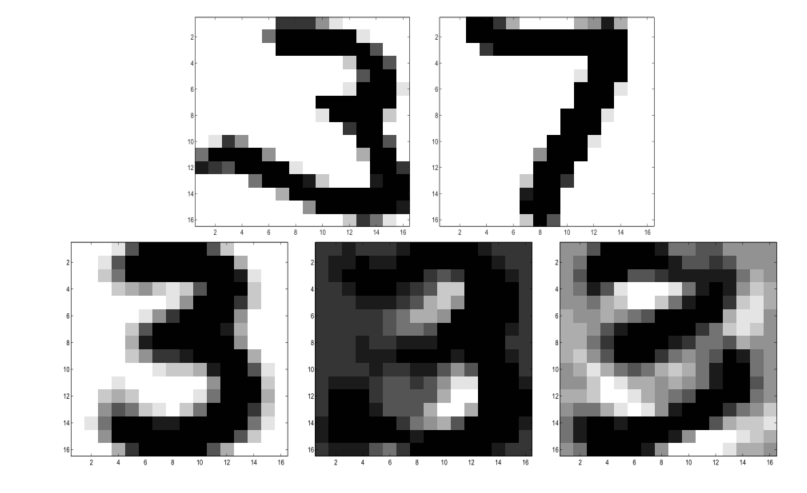
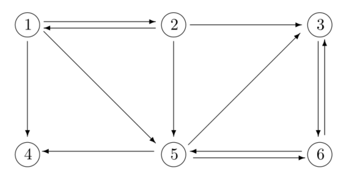

## 1.1 数据挖掘与模式识别

在现代社会中，大量数据被收集并存储在计算机中，以便以后可以提取有用的信息。通常在收集时不知道以后会请求什么数据，因此数据库不是为了提取任何特定信息而设计的，而是在很大程度上是非结构化的。从大型数据集中提取有用信息的科学通常被称为“数据挖掘”，有时会增加“知识发现”。

模式识别通常被认为是一种与数据挖掘不同的技术，但其定义是相关的： “采用原始数据并根据模式的'类别'采取行动的行为”[31]。在本书中，我们不会强调概念之间的差异。

数据挖掘有许多应用领域，从电子商务[10,69]到生物信息学[6]，从科学应用，如金星[21]上的火山分类到信息检索[3]和互联网搜索引擎[ 11]。

数据挖掘是一门真正的跨学科科学，其中使用来自计算机科学，统计学和数据分析，线性代数和优化的技术，这些技术通常采用相当折衷的方式。由于应用的实际重要性，该领域现在有许多书籍和文献[24,25,31,35,45,46,47,49,108]。

可以毫不夸张地说，日常生活中充满了我们通常不知不觉地依赖于先进的数据挖掘数学方法的情境。线性代数和数据分析等方法是许多数据挖掘技术的基本要素。本书介绍了数学和数值方法及其在数据挖掘和模式识别中的应用。

## 1.2 向量和矩阵

以下示例说明了向量和矩阵在数据挖掘中的使用。这些示例介绍了本书中讨论的主要数据挖掘区域，将在第II部分中对其进行更详细的描述。

在许多应用中，矩阵只是一个矩形的数据数组，元素是标量的实数

$$A = \left( \begin{array} { c c c c } { a _ { 11 } } & { a _ { 12 } } & { \cdots } & { a _ { 1 n } } \\ { a _ { 21 } } & { a _ { 22 } } & { \cdots } & { a _ { 2 n } } \\ { \vdots } & { \vdots } & { } & { \vdots } \\ { a _ { m 1 } } & { a _ { m 2 } } & { \cdots } & { a _ { m n } } \end{array} \right) \in \mathbb { R } ^ { m \times n }$$

要通过数学方法处理数据，必须添加一些数学结构。在最简单的情况下，矩阵的列被视为向量$\mathbb {R} ^ {m}$

**例1.1** 术语文档矩阵用于信息检索。考虑以下五个文件的选择$^1$。关键词，我们称之为术语，用粗体标出$^2$。

文档1：**Google$\rm ^{TM}$矩阵**P是**互联网**的模型。
文档2：如果存在从**网页**j到i的**链接**，则$P_{ij}$非零。
文档3：**Google矩阵**用于对所有**网页**进行**排名**。
文档4：通过解决**矩阵特征值**问题来完成**排名**。
文档5：**英格兰队**退出**国际足联**排名前十

如果我们计算每个文档中术语的频率，我们会得到以下结果：

| Term       | Doc 1 | Doc 2 | Doc 3 | Doc 4 | Doc 5 |
| ---------- | ----- | ----- | ----- | ----- | ----- |
| eigenvalue | 0     | 0     | 0     | 1     | 0     |
| England    | 0     | 0     | 0     | 0     | 1     |
| FIFA       | 0     | 0     | 0     | 0     | 1     |
| Google     | 1     | 0     | 1     | 0     | 0     |
| Internet   | 1     | 0     | 0     | 0     | 0     |
| link       | 0     | 1     | 0     | 0     | 0     |
| matrix     | 1     | 0     | 1     | 1     | 0     |
| page       | 0     | 1     | 1     | 0     | 0     |
| rank       | 0     | 0     | 1     | 1     | 1     |
| Web        | 0     | 1     | 1     | 0     | 0     |

$^{1}$在5号文档中，国际足联是国际足球联合会的成员。这份文件显然与足球有关。该文章是2005年的报纸头条。2006年世界杯结束后，英格兰重返前十。
$^{2}$为了避免使示例过大，我们忽略了一些通常被视为术语的单词（关键词）。请注意，只有单词的词干是重要的。

因此，每个文档都由$\mathbb { R } ^ { 10 }$中的向量或点表示，我们可以将所有文档组织成一个term-document矩阵：

$A = \left( \begin{array} { c c c c c } { 0 } & { 0 } & { 0 } & { 1 } & { 0 } \\ { 0 } & { 0 } & { 0 } & { 0 } & { 1 } \\ { 0 } & { 0 } & { 0 } & { 0 } & { 1 } \\ { 1 } & { 0 } & { 1 } & { 0 } & { 0 } \\ { 1 } & { 0 } & { 0 } & { 0 } & { 0 } \\ { 0 } & { 1 } & { 0 } & { 0 } & { 0 } \\ { 1 } & { 0 } & { 1 } & { 1 } & { 0 } \\ { 0 } & { 1 } & { 1 } & { 0 } & { 0 } \\ { 0 } & { 0 } & { 1 } & { 1 } & { 1 } \\ { 0 } & { 1 } & { 1 } & { 0 } & { 0 } \end{array} \right)$

现在假设我们想要在所有文档中查找“**网页排名**”相关文档。这由向量*query*表示，以类似于term-document矩阵的方式构造：

$q = \left( \begin{array} { l } { 0 } \\ { 0 } \\ { 0 } \\ { 0 } \\ { 0 } \\ { 0 } \\ { 0 } \\ { 1 } \\ { 1 } \\ { 1 } \end{array} \right) \in \mathbb { R } ^ { 10 }$

因此，query本身被视为文档。现在可以将信息检索任务表述为数学问题：*找到接近向量q的列A*。要解决这个问题，我们必须在$\mathbb {R} ^ {10}$中使用一些距离测量。

在信息检索应用中，维度m通常很大，比如$10^6$。此外，由于大多数文档仅包含一小部分术语，因此矩阵中的大多数元素等于零。这种矩阵称为*稀疏*矩阵。

一些用于信息检索的方法使用线性代数技术（例如，奇异值分解（SVD））来进行数据压缩和检索增强。第11章介绍了用于信息检索的向量空间方法。

将矩阵不仅视为数字数组，还是作为一组向量，而且作为线性算子，通常是有用的。表示A的列

$a _{ . j } = \left(\begin{array} { c } { a _{ 1 j } } \\ { a _{ 2 j } } \\ { \vdots } \\ { a _{ m j } } \end{array} \right) , \quad j = 1,2 , \ldots , n$

矩阵A表示为

$A = \left(\begin{array} { l l l l } { a ._1 } & { a . _2 } & { \cdots } & { a. _{ n } } \end{array} \right)$

然后定义线性变换

$y = A x = \left(\begin{array} { c c c c } { a .1 } & { a .2 } & { \ dots } & { a _{ . n } } \end{array} \right) \left(\begin{array} { c } { x _{ 1 } } \\ { x _{ 2 } } \\ { \vdots } \\ { x _{ n } } \end{array} \right) = \sum\limits_{ j = 1 } ^ { n } x _{ j } a _{ . j }$

例1.2 手写数字的分类是*模式识别*中的模型问题。这里的向量用于表示数字。一个数字的图像是16×16的数字矩阵，表示灰度。它也可以通过堆叠矩阵的列表示为$\mathbb{R}^{256}$中的矢量。然后，一组n个数字（比如说是手写的3）可以由矩阵$A\in \mathbb{R}^{256\times n}$表示，并且A的列跨越$\mathbb{R}^{256}$的子空间。我们可以使用SVD $A=U\Sigma V^T$计算该子空间的近似基础。 “子子空间”的三个基矢量如图1.1所示。

图1.1 *来自美国邮政服务数据库的手写数字[47]和3的基本向量（底部）*

设b是表示未知数字的向量。我们现在想要将未知数字（通过计算机自动）分类为数字0到9之一。给定一组3的近似基矢量，$u_1，u_2，\cdots，u_k$，我们可以通过检查是否存在基矢量的线性组合来确定b是否为3。 $k_{j = 1}^k x_j u_j$，像这样

$b - \sum\limits_ { j = 1 } ^ { k } x _ { j } u _ { j }$

$P = \left( \begin{array} { c c c c c c } { 0 } & { \frac { 1 } { 3 } } & { 0 } & { 0 } & { 0 } & { 0 } \\ { \frac { 1 } { 3 } } & { 0 } & { 0 } & { 0 } & { 0 } & { 0 } \\ { 0 } & { \frac { 1 } { 3 } } & { 0 } & { 0 } & { \frac { 1 } { 3 } } & { \frac { 1 } { 2 } } \\ { \frac { 1 } { 3 } } & { 0 } & { 0 } & { 0 } & { \frac { 1 } { 3 } } & { 0 } \\ { \frac { 1 } { 3 } } & { \frac { 1 } { 3 } } & { 0 } & { 0 } & { 0 } & { \frac { 1 } { 2 } } \\ { 0 } & { 0 } & { 1 } & { 0 } & { \frac { 1 } { 3 } } & { 0 } \end{array} \right)$